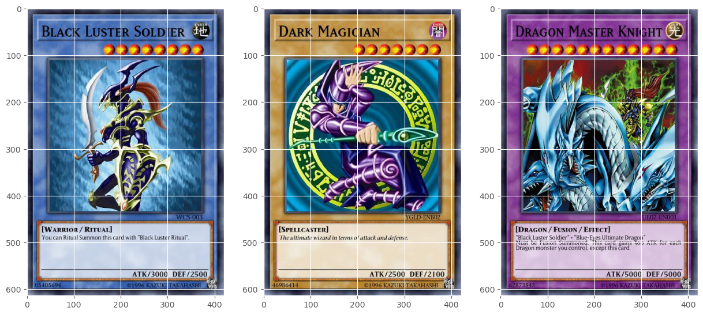
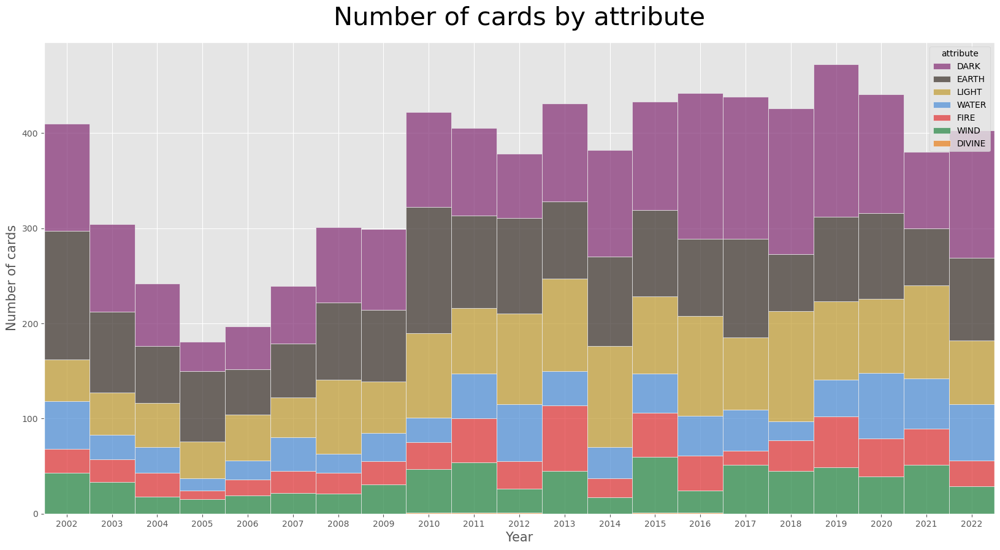

# RTG #3: EDA on Yu-Gi-Oh!

This is Road to Grandmaster's third entry. In this one we do some exploratory data analysis using YGOProDeck's database to extract insight on how Yu-Gi-Oh! has evolved throughout the years. The questions we aim to answer are the following:
* Which attribute type has the most amount of supporting cards?
* What are some of the most loved/hated cards?
* When did special summoning started gaining popularity?
* Are we getting more or less reprints?

## Reproducing
For starters, to download the data automatically, you'll need to have your Kaggle API credentials set up (you need a Kaggle account):
1. At Kaggle, go to the Account tab (top right after clicking on you profile picture)
2. Click on "Create API Token" and download the `kaggle.json` file
3. Move the `kaggle.json` file to a `.kaggle` folder on you home directory:

    Linux: `~/.kaggle/kaggle.json`

    Windows: `C:\Users\<Windows-username>\.kaggle\kaggle.json`

Then you can install the requirements (preferably in a virtual environment) with:
```bash
python3 -m pip install requirements.txt
```
Finally run the `get_data.py` script:
``` bash
python data/get_data.py
```
Now `notebook.ipynb` is ready to execute.

## Sample visualizations




## Links
* [Accompanying blog post](https://www.pacifis.org/rtg3/)
* [Kaggle notebook](https://www.kaggle.com/carlosgdcj/eda-on-yu-gi-oh/)
* [Kaggle dataset](https://www.kaggle.com/datasets/ioexception/yugioh-cards)